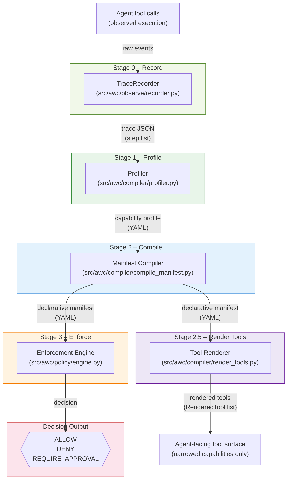

# Architecture

The Agent World Compiler PoC is structured as a linear pipeline with four named stages. Each stage has a clear input and a clear output.

## End-to-end pipeline



The trace is the first concrete runtime artifact. Profile, manifest, and decisions are all derived from it.

## Component responsibilities

| Component | File(s) | Role |
| --- | --- | --- |
| **TraceRecorder** | `src/awc/observe/recorder.py` | Stage 0 — records agent tool calls into a trace JSON file. The fixtures in `fixtures/traces/` are the saved output of a recorder. |
| Trace fixtures | `fixtures/traces/*.json` | Recorded observations of agent/tool execution. Used as pipeline inputs in examples and tests. |
| **Profiler** | `src/awc/compiler/profiler.py` | Stage 1 — reads one or more traces and derives a `CapabilityProfile`. Tainted steps (by provenance) are counted but never widen the allowed set. |
| **Manifest compiler** | `src/awc/compiler/compile_manifest.py` | Stage 2 — translates a `CapabilityProfile` into a structured YAML manifest. Applies safe compression: may reduce precision, but cannot add capabilities absent from the trace. |
| **Tool renderer** | `src/awc/compiler/render_tools.py` | Stage 2.5 — projects manifest `allowed_actions` into a list of `RenderedTool` descriptors. Each rendered tool is a narrowed, agent-facing capability descriptor. Forbidden capabilities are absent from the rendered surface. No-expansion invariant: rendered tools may only be derived from manifest capabilities, never introduce new ones. |
| **Taint module** | `src/awc/policy/taint.py` | Derives taint deterministically from `input_sources × bootstrap trust model`. Propagates taint through `depends_on`. |
| **Enforcement engine** | `src/awc/policy/engine.py` | Stage 3 — evaluates a single trace step against a manifest and returns a deterministic `Decision`. |
| CLI wrapper | `src/awc/policy/evaluate.py` | Iterates all steps of a trace and prints a decision table. |
| Demo runner | `examples/demo_pipeline.py` | Executes the full pipeline from fixtures and prints a human-readable summary, including the rendered-tools table. |
| Record + compile demo | `examples/record_and_compile.py` | Shows the full pipeline starting from `TraceRecorder` — no fixture files needed. |

## Bootstrap trust model

The taint module defines a built-in default trust mapping:

```python
DEFAULT_INPUT_TRUST = {
    "repo_local":   "trusted",
    "environment":  "untrusted",
    "llm_output":   "untrusted",
    "tool_output":  "conditional",
}
```

This is the **bootstrap trust model** — the system's starting assumption about input sources. It is not user-authored; it is built in. The manifest compiler copies this mapping into the manifest's `input_trust` block. It can be refined in a specific manifest, but the bootstrap defaults apply unless overridden.

## Taint derivation

Taint is derived, not annotated. The derivation is deterministic:

1. For each step, look up each `input_source` in the `input_trust` map.
2. If any source resolves to `untrusted` or `conditional`, the step is **source-tainted**.
3. If any step in `depends_on` is tainted (transitively), the step is **propagation-tainted**.
4. Final taint = source taint OR propagation taint.

The legacy `tainted: true/false` annotation in older traces is ignored. Provenance and flow are the only source of truth.

## Data model

```text
Trace (JSON)
  └── steps[]
        ├── tool          (string)
        ├── action        (string)
        ├── resource      (URI string)
        ├── input_sources (list[string])
        └── depends_on    (list[string])

CapabilityProfile (Python dataclass / YAML)
  ├── allowed_tools     (set)
  ├── allowed_actions   (set)
  └── allowed_resources (set of URI prefixes)

WorldManifest (YAML)
  ├── allowed_actions[]
  │     ├── action
  │     ├── permitted_resources[]
  │     ├── trust_required
  │     └── taint_ok
  ├── approval_required[]
  ├── denied_actions[]
  ├── input_trust{}          ← compiled from bootstrap trust model
  ├── capability_constraints{}
  └── provenance{}

RenderedTool (Python dataclass)   ← Stage 2.5 output
  ├── name                   deterministic identifier (e.g. git_push_origin_only)
  ├── base_tool              underlying tool name
  ├── action                 action identifier (same as base_tool in this PoC)
  ├── description            human-readable summary
  ├── input_schema           minimal JSON schema for allowed inputs
  ├── fixed_args             pre-applied args (e.g. {remote: origin})
  ├── allowed_resource_patterns  resource constraints preserved from manifest
  ├── trust_required         minimum trust level
  └── taint_ok               whether tainted input is tolerated
```

The `RenderedTool` list is the agent-facing surface: raw tools are broad; rendered tools are narrowed capabilities. Capabilities not in `allowed_actions` (i.e. those in `denied_actions` or absent entirely) are not exposed as rendered tools at all.

Rendered tools are not a convenience layer; they are a projection of the same boundary enforced by the policy engine. Each manifest defines a boundary for a specific workflow, not for the agent globally.

### Current abstraction level

The trace schema captures `(tool, action, resource)` per step. The profiler and compiler currently collapse some of this structure — for example, actions are grouped by type rather than tracked as distinct `(tool, action, resource)` triples in the manifest. This is a deliberate PoC simplification; the trace schema retains the richer structure for future use.

## Restriction hierarchy

There are two distinct levels at which an action can be unavailable to the agent:

1. **Ontology (rendered tools)** — Does this action exist? If it is not in the manifest's `allowed_actions`, it is never rendered as a tool. The agent has no surface to invoke it.
2. **Policy (manifest)** — Is it allowed? If the action exists but the manifest denies it, the enforcement engine returns `DENY`.
3. **Enforcement (engine)** — The engine applies the decision. It evaluates a concrete step against the manifest and returns `ALLOW`, `DENY`, or `REQUIRE_APPROVAL`.

> First: does this action exist? Then: is it allowed?

Some actions do not exist in the compiled boundary. Others exist but are not allowed.

---

## Decision rules (priority order)

1. **Taint + external resource** → `DENY`
2. **Explicitly denied action** → `DENY`
3. **Action not in allowed set** → `DENY` *(undefined = deny)*
4. **Resource outside permitted patterns** → `DENY`
5. **Input trust below required** → `DENY`
6. **Matches approval_required** → `REQUIRE_APPROVAL`
7. **Otherwise** → `ALLOW`

## Core invariants

1. **Determinism** — same manifest + same step → same decision, always.
2. **Undefined = deny** — any action not listed in `allowed_actions` is rejected.
3. **Safe compression** — the manifest may compress observed behavior, but must not introduce capabilities absent from the safe trace.
4. **Taint safety** — tainted data cannot trigger an external side effect; taint is derived from provenance, not from an annotation.
5. **Approval gates** — sensitive operations surface as `REQUIRE_APPROVAL` rather than being silently allowed or denied.
6. **No expansion (rendered tools)** — rendered tools may only be derived from manifest `allowed_actions`; they must never introduce capabilities not already present in the manifest. The count of rendered tools equals the count of allowed_action entries.
