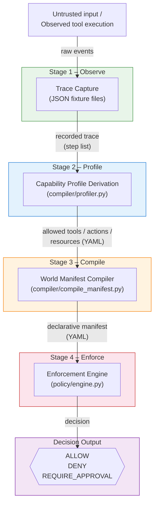

# Architecture

The Agent World Compiler PoC is structured as a linear pipeline with four
named stages.  Each stage has a clear input and a clear output.

## End-to-end pipeline



## Component responsibilities

| Component | File(s) | Role |
|---|---|---|
| Trace fixtures | `traces/*.json` | Immutable, recorded observations of agent/tool execution. |
| Profiler | `compiler/profiler.py` | Derives a `CapabilityProfile` from one or more traces.  Tainted steps are counted but never widen the allowed set. |
| Manifest compiler | `compiler/compile_manifest.py` | Translates a `CapabilityProfile` into a structured YAML manifest. |
| Enforcement engine | `policy/engine.py` | Evaluates a single trace step against a manifest and returns a deterministic `Decision`. |
| CLI wrapper | `policy/evaluate.py` | Iterates all steps of a trace and prints a decision table. |
| Demo runner | `demo/run.py` | Executes the full four-stage pipeline and prints a human-readable summary. |

## Data model

```
Trace (JSON)
  └── steps[]
        ├── tool          (string)
        ├── action        (string)
        ├── resource      (URI string)
        ├── input_sources (list[string])
        └── tainted       (bool)

CapabilityProfile (Python dataclass / YAML)
  ├── allowed_tools     (set)
  ├── allowed_actions   (set)
  └── allowed_resources (set of URI prefixes)

WorldManifest (YAML)
  ├── allowed_actions[]
  │     ├── action
  │     ├── permitted_resources[]
  │     ├── trust_required
  │     └── taint_ok
  ├── approval_required[]
  ├── denied_actions[]
  ├── input_trust{}
  ├── capability_constraints{}
  └── provenance{}
```

## Decision rules (priority order)

1. **Taint + external** → `DENY`
2. **Explicitly denied action** → `DENY`
3. **Action not in allowed set** → `DENY` *(undefined = deny)*
4. **Resource outside permitted patterns** → `DENY`
5. **Input trust below required** → `DENY`
6. **Matches approval_required** → `REQUIRE_APPROVAL`
7. **Otherwise** → `ALLOW`
